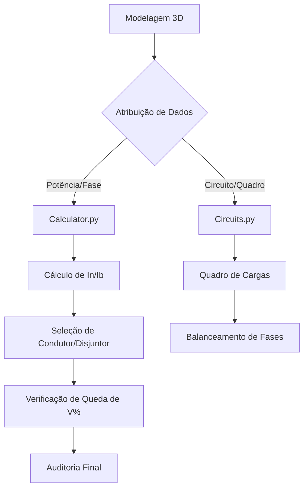

# Memória Técnica - Bancada Eletrica (FreeCAD 1.1)
**Versão**: 4.0 (Elite Industrial Suite)
**Última Atualização**: 2026-05-14

---

## 1. Visão Geral
A bancada **Eletrica** é uma ferramenta profissional para o FreeCAD 1.1 focada em projetos de engenharia elétrica. O objetivo é fornecer ferramentas para modelagem 3D, cálculos normatizados (NBR 5410) e geração de documentação técnica automática, integrando-se nativamente às bancadas BIM e Draft do FreeCAD.

---

## 2. Escopo Técnico
- **Base Normativa**: NBR 5410 (Instalações elétricas de baixa tensão), com suporte parcial à NBR 14039 (Média Tensão) e NDUs das concessionárias (Energisa NDU-001, Cemig ND-5.1, Enel NTC-901001, Neoenergia PAD-DIS-SRT/BT-001, Copel NTC-905200).
- **Abordagem BIM**: Cada componente (tomada, conduíte, quadro) possui metadados técnicos (potência, corrente, queda de tensão, material, circuito, fase).
- **Integração**: Compatível com as ferramentas nativas de Arquitetura (Arch/BIM) e Draft do FreeCAD, com suporte a arquivos IFC via `Arch_Reference` e `BIM_IfcExplorer`.

---

## 3. Arquitetura do Sistema

```
Eletrica/
├── InitGui.py          # Registro da bancada, toolbars e proxies de comandos externos
├── EletricaGui.py      # Classes de comando Qt (GUI) - todos os botões da interface
├── EletricaPanel.py    # Painel lateral de métricas (Dashboard)
├── Init.py             # Inicialização não-gráfica
├── Icons/              # Ícones SVG e PNG da bancada
│   └── Raio.svg        # Ícone principal da bancada
└── EletricaLogic/      # Lógica de engenharia (pura, sem Qt)
    ├── Calculator.py       # Cálculos NBR 5410 (seção, queda, disjuntor, demanda)
    ├── Circuits.py         # Quadro de Cargas e balanceamento de fases
    ├── Panels.py           # Hierarquia de quadros (QDC, CCM, CCA)
    ├── ServiceEntrance.py  # Assistente de Padrão de Entrada por concessionária
    ├── Lighting.py         # Interruptores e mesclagem de placas
    ├── Auditor.py          # Auditoria técnica do projeto (Clash Detection + NBR)
    ├── Library.py          # Gerenciador de biblioteca de componentes 3D
    ├── Conduit.py          # Eletrodutos e taxa de ocupação
    ├── Wiring.py           # Roteamento e comprimento de circuitos
    ├── Equipment.py        # BIMificação de equipamentos
    ├── Solar.py            # Estimativa de sistemas fotovoltaicos
    └── ...                 # Outros módulos especializados
```

- **Linguagem**: Python 3 (API do FreeCAD).
- **Interface**: PySide2 / PySide6 (Qt) — compatível com FreeCAD 1.1.
- **Estrutura de Dados**: Propriedades Customizadas (`App::Property`) para armazenar dados de engenharia nos objetos 3D diretamente no arquivo `.FCStd`.

---

## 4. Metadados do Projeto (ProjectData)
Cada documento pode conter um objeto oculto `Eletrica_ProjectData` com as seguintes propriedades:

| Propriedade   | Grupo    | Descrição                                      |
|---------------|----------|------------------------------------------------|
| ProjectName        | Geral      | Nome do projeto                                |
| Author             | Geral      | Autor / Engenheiro Responsável                 |
| ProjectType        | Geral      | Tipo de obra (Residencial, Comercial, etc.)    |
| Utility            | Técnico    | Concessionária de energia                      |
| PrimaryVoltage     | Técnico    | Tensão primária MT (ex: 13.8kV, 34.5kV)        |
| Voltage            | Técnico    | Tensão secundária BT (ex: 220/380V, 660V)      |
| SystemPhases       | Técnico    | Sistema de Fases (Monofásico, Bifásico, etc.)  |
| TrafoPower           | Técnico    | Potência do Trafo (kVA) para Icc              |
| ConductorMaterial   | Técnico    | Material (Cobre ou Alumínio)                  |
| InsulationType      | Técnico    | Tipo de isolação (PVC 70°C ou EPR 90°C)       |
| CableType           | Técnico    | Construção (Unipolar ou Multipolar)           |
| InstallationMethod  | Técnico    | Método NBR 5410 (A1, B1, C, D, E, F, G)       |
| AmbientTemperature | Técnico    | Temperatura para Fator de Correção (FCT)      |
| PowerFactor        | Técnico    | Fator de Potência Global (cos φ)              |
| MaxVoltageDrop     | Técnico    | Limite de queda de tensão (4%, 5%, 7%)        |
| TrafoConnection    | Técnico    | Grupo vetorial (ex: Dyn11, Yy0)                |
| Phase              | Técnico    | Fase do projeto (Executivo, As-Built, etc.)    |
| DesignerName       | Projetista | Nome do responsável técnico                    |
| DesignerProfession | Projetista | Profissão (Eng. Eletricista, Técnico, etc.)    |
| CREA               | Projetista | Número do CREA / CFEEE                         |
| ART                | Projetista | Número da ART registrada no CONFEA             |

Estes dados são usados automaticamente por `Calculator.calculate_demand()` e `ServiceEntranceWizard.recommend_entrance()`.

---

## 5. Funcionalidades Principais

### 5.1 Cálculos Elétricos (`Calculator.py`)
- **Corrente nominal**: monofásico e trifásico, lendo tensão e sistema do ProjectData.
- **Seção de cabos**: Tabelas NBR 5410 para métodos B1 (embutido) e D (enterrado).
- **Queda de tensão**: Cálculo percentual com resistividade de Cu e Al.
- **Fator de Agrupamento (FCA)**: Tabela 40 da NBR 5410, com suporte a leitos.
- **Disjuntor comercial**: Série DIN padrão.
- **Curto-circuito simplificado**: Estimativa em kA.
- **Demanda**: Fator variável por tipo de instalação (Residencial 60%, Comercial 75%, Industrial 85%, Predial 65%, Público 70%).

### 5.2 Quadro de Cargas (`Circuits.py`)
- Coleta automática de cargas dos objetos do documento.
- Detecção automática de DR por palavra-chave (Cozinha, Banheiro, etc.).
- Aplicação do FCA conforme agrupamento em eletrodutos.
- Balanceamento automático de fases (R, S, T) por algoritmo de empacotamento.

### 5.3 Quadros de Distribuição (`Panels.py`)
- Hierarquia multinível (QDC → Sub-QDC → CCM) com propagação correta de cargas (sem dupla contagem).
- Suporte a CCM (Motores), CCA (Automação) e Medidores.

### 5.4 Padrão de Entrada (`ServiceEntrance.py`)
- Base de dados das normas técnicas de: **Cemig**, **Energisa**, **Enel**, **CPFL**, **Neoenergia**, **Copel**.
- Recomendação automática de disjuntor, seção de cabo e caixa de medição por demanda calculada.
- Busca tolerante a nomes (integrada com o campo Concessionária das propriedades do projeto).

### 5.5 Auditoria (`Auditor.py`)
- Verificação de objetos sem circuito ou sem quadro vinculado.
- Verificação de eletrodutos superlotados (> 40% de ocupação, NBR 5410).
- Clash Detection 3D com coloração visual de colisão (laranja).
- Resultado exibido em janela Qt com ✅/❌/⚠️.

### 5.6 Elétrica Industrial — Fase 2 (`Starters.py` + UI)
- **Catálogo WEG 1 a 1000 CV**: MPW (até 75 CV) → DWJ Caixa Moldada (100–700 CV) → ACB Aberto (800–1000 CV).
- **Assistente de Motor Industrial**: calcula In, I_partida, relé térmico, seção de cabo, disjuntor e seleciona kit WEG (contatora, SSW ou CFW) conforme método de partida.
- **Métodos suportados**: Direta, Estrela-Triângulo, Soft-Starter (SSW), Inversor de Frequência (CFW).
- **Objeto BIM de Motor**: salvo no documento com propriedades `Potencia_CV`, `CorrenteNom`, `TipoPartida`, `KitWEG`.
- **Seletividade**: verifica coordenação amperimétrica entre disjuntores (razão ≥ 1,6 — IEC 60947).
- **Barramentos**: dimensiona perfil comercial de Cu ou Al (2,5 A/mm² Cu / 1,6 A/mm² Al) por faixa de corrente.
- **Diagrama CCM**: gera planilha estruturada com todos os motores do projeto.

### 5.7 Redes Aéreas de Distribuição (RDU/RDR) — Fase 3
- **Condutores CA, CAA e Aço**: Tabelas completas incluindo cabos de Alumínio e Fios de Aço Zincado para sistemas **MRT (Rural)**.
- **Cálculo Mecânico Avançado**: Integração de pressão do vento (daN/m²), ângulo de deflexão e cálculo de flecha (sag) via equação da parábola.
- **Rede de Distribuição Rural (RDR)**: Suporte a vãos longos (120m), postes de madeira (MA) e sistema Monofilar com Retorno por Terra.
- **Kits de Estruturas**: Explosão automática de materiais (N1, N3, CE1, CE3, M1) em componentes individuais (cruzetas, isoladores, parafusos).

### 5.8 Subestações e Média Tensão (MT)
- **Subestações de Cabine Primária**: Inserção de cubículos de MT (Medição, Proteção, Entrada) em alvenaria ou blindados.
- **Capacidades Industriais**: Transformadores de 5 kVA a 2500 kVA (Seco ou Óleo).
- **Proteção e Coordenação**: Tabela de elos fusíveis (Tipo H/K) automatizada para sistemas de 13.8 kV a 34.5 kV.
- **Barramentos de MT**: Dimensionamento de barras de cobre para cubículos.

### 5.9 Energia Solar Fotovoltaica (PV)
- **Estimativa de Geração**: Cálculo de kWh/mês baseado na irradiação local ($E = P \cdot H \cdot 30 \cdot PR$).
- **Dimensionamento de Strings**: Lógica de série/paralelo para inversores de string.
- **Lançamento de Arrays**: Ferramenta de locação em massa de painéis solares para usinas de telhado ou solo.

### 5.10 Sistemas Especiais (SDAI, CFTV, Sonorização)
- **Incêndio (SDAI)**: Locação de detectores, acionadores e sirenes com controle de raio de cobertura (NBR 17240).
- **Segurança**: Câmeras IP (Bullet/Dome), sensores PIR e controle de acesso biométrico.
- **Sonorização**: Caixas de som de teto e cornetas industriais para avisos de emergência.

### 5.11 Ciclo de Vida BIM (4D até 8D)
- **BIM 4D/5D**: Geradores de Cronograma de Obra e Orçamento Detalhado (Materiais + MO).
- **BIM 6D/7D**: Relatório ESG (Sustentabilidade) e Plano de Manutenção Preventiva.
- **BIM 8D**: Plano de Segurança e Saúde Ocupacional (Prevenção NR-10).

### 5.12 Integração GIS e Geoprocessamento
- **Conversor GIS**: Transforma pontos georreferenciados do QGIS diretamente em postes inteligentes no FreeCAD.
- **Exportador KML**: Gera arquivos para o Google Earth, permitindo visualização da rede em dispositivos móveis no campo.

---

## 6. Arquitetura de Proxy de Comandos e Ponte de Recursos (InitGui.py)
Para evitar erros de "Unknown command" ou "Cannot find icon" ao carregar a bancada antes do BIM/Draft, todos os comandos externos são registrados como `ExternalToolProxy`. 

- **Proxy de Execução**: Ao clicar, o proxy tenta executar o comando diretamente e, se falhar, ativa a bancada BIM em background e tenta novamente. Isso garante carregamento estável sem travar o FreeCAD.
- **Ponte de Recursos (Icon Bridge)**: No startup, o `InitGui.py` executa uma varredura no `sys.path` para localizar a pasta física da bancada BIM. Ao encontrá-la, ele utiliza `FreeCADGui.addIconPath()` para registrar os ícones originais do BIM no sistema global do FreeCAD.
- **Mapeamento de Ícones Nativo**: Para garantir a identidade visual correta:
    *   `BIM_IfcExplorer`: Mapeado para o ícone nativo `IFC`, garantindo a visualização da árvore de dados original.
    *   `Arch_Reference`: Utiliza o ícone nativo `Arch_Reference` (caixa azul).
    *   **Fallback**: Caso um recurso externo falhe no carregamento, o sistema utiliza o ícone de marca da bancada (`Raio.svg`) ou o nome do comando como Pixmap para evitar que o botão fique vazio.

---

## 9. Estabilização da Inicialização (FreeCAD 1.1)
Devido à arquitetura do FreeCAD 1.1, onde o arquivo `InitGui.py` é executado via `exec()`, foram implementadas as seguintes proteções para evitar erros fatais (NameError):

- **Detecção de Caminho**: O uso de `__file__` é verificado via `globals()`. Caso ausente, a variável `ELETRICA_DIR` é definida via `FreeCAD.getUserAppDataDir()`, garantindo que ícones e imports funcionem em qualquer contexto de carregamento.
- **Escopo de Tradução**: A função `tr()` foi encapsulada dentro do método `Initialize()` da classe `EletricaWorkbench`. Isso isola a lógica de tradução do escopo global do interpretador, que pode ser instável durante o startup do FreeCAD.
- **Lazy Loading**: Imports pesados (`EletricaGui`, `EletricaPanel`) são realizados apenas dentro do método `Initialize`, reduzindo o tempo de boot do FreeCAD e evitando conflitos de importação circular.

---

## 10. Integração de Bibliotecas
- **Biblioteca 3D**: `D:\Objetos 3D\Curso FRECAD ELETRICO\HRC_Nova_Biblioteca_3D`. Objetos importados como referências externas com propriedades BIM acopladas.
- **Referências BIM**: Via `Arch_Reference` e `BIM_IfcExplorer` (disponíveis na barra "Referência BIM").

---

## 8. Bugs Corrigidos na Versão 3.0
| Módulo             | Bug                                         | Solução                              |
|--------------------|---------------------------------------------|--------------------------------------|
| `Substation.py`    | Texto `Broadway` corrompido no final         | Arquivo reescrito e expandido               |
| `Calculator.py`    | `@staticmethod` órfão (SyntaxError)         | Removido bloco inválido                     |
| Calculator.py      | Fator de demanda fixo em 0.6                | Fator dinâmico por tipo de obra      |
| Panels.py          | Dupla contagem na propagação hierárquica    | Controle `already_propagated`        |
| Auditor.py         | Crash em objetos sem `.Shape`               | Guard `hasattr` + try/except         |
| Auditor.py         | Resultado da auditoria invisível ao usuário | Janela Qt com relatório completo     |
| Lighting.py        | Crash no `merge_switches` sem `Comando`     | Guard de validação com aviso         |
| ServiceEntrance.py | Nomes de concessionárias inconsistentes     | Padronização + busca tolerante       |
| InitGui.py         | `FreeCADGui.getCommand` inexistente         | Substituído por sistema de Proxy     |
| InitGui.py         | `NameError: tr` / `NameError: _p`           | Encapsulamento em Initialize + globals |
| EletricaGui.py     | SyntaxError (Ellipsis `...`)                | Limpeza do dicionário de comandos    |

---

## 9. Fluxo de Processamento de Dados (Engenharia)


## 10. Recomendações de Melhoria Futura
1. **Cache de Cálculos**: Implementar um sistema de cache para evitar recomputar todo o quadro de cargas em projetos com > 500 pontos.
2. **Geometria Dinâmica**: Usar `Part::FeaturePython` para eletrodutos que se ajustam automaticamente ao mover as caixas de passagem.
3. **API REST**: Criar um endpoint local para permitir que aplicativos mobile acessem o status do projeto em tempo real.

---
*Este documento é parte integrante da documentação técnica da bancada Eletrica.*
